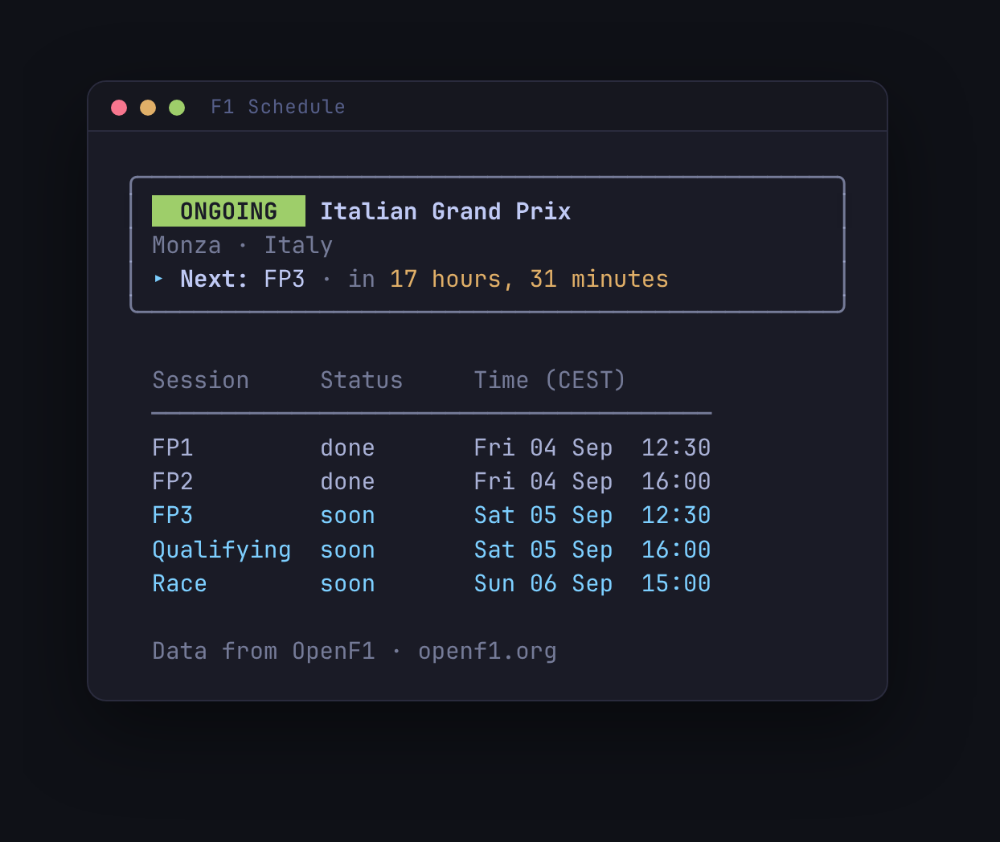

# F1 Schedule

A small CLI for the current Formula 1 race weekend. Run it to see which session is live or next, and the full timetable in your local time — handy when you want to know what's on without seeing results or standings.

## Try it

You need [Go](https://go.dev/) 1.24 or newer.

```bash
go run .
```

That prints the active or upcoming Grand Prix. This is the Italian Grand Prix weekend, captured on Friday 4 September 2026, with FP3 still to come:



Times follow your system timezone, including 12-hour vs 24-hour. If the circuit uses a different offset, a second column shows circuit local time.

To install a binary on your `PATH`:

```bash
go build
./f1schedule
```

## During a live session

While a session is running, OpenF1 locks unauthenticated access. After a successful run, the season timetable is saved to `~/.cache/f1schedule/schedule.json`. The next time the API is locked, the app uses that cache, marks the output as cached, and warns if the file is from before this race weekend.

## Credits

Session times come from [OpenF1](https://openf1.org/). They publish Formula 1 schedule and timing data as an open API — this CLI is only as useful as that work.

Built with [Grok](https://x.ai), the workhorse on the implementation, alongside Allan.
